# Grihasti E-commerce App

Made by [`@iresharma`](https://github.com.iresharma)
It's a freelance project, Flutter app with firebase backend. I am bad at writing long things so i'll just put all the screenshots

### All of the UI was self made

## Screenshots

| SplashScreen |
|--------------|
|  |

| Login Screen | Login Screen | Not Serving |
|--------------|--------------|-------------|
| 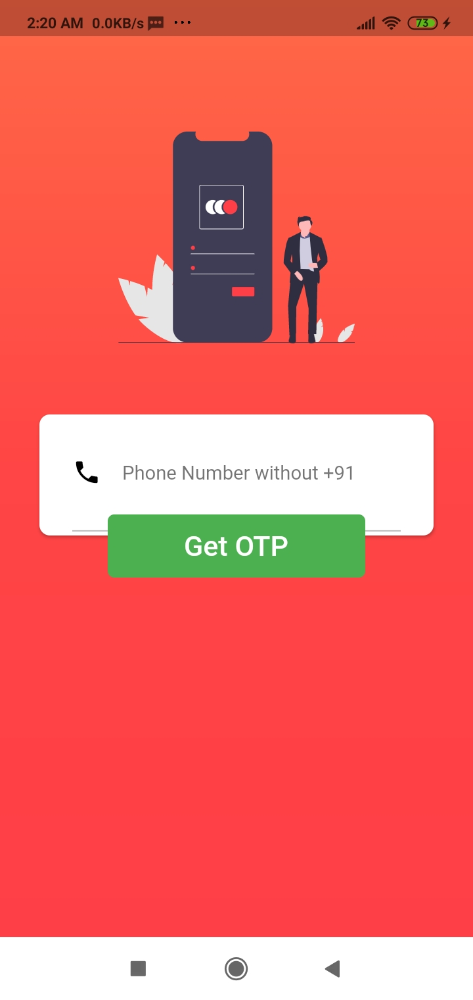 | 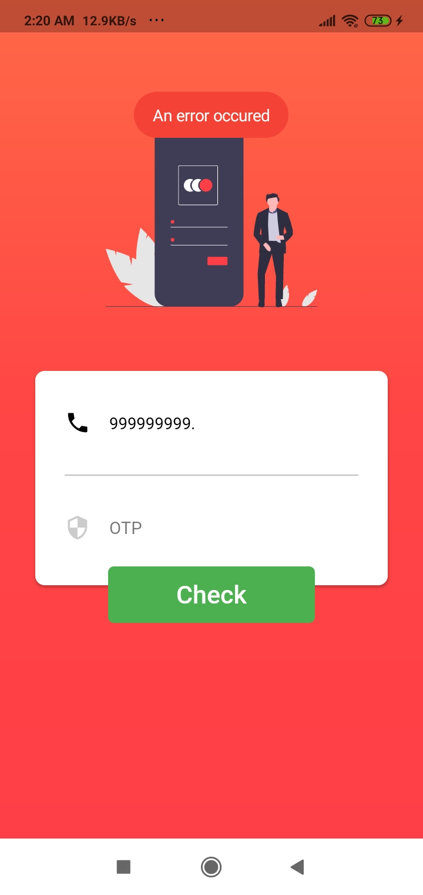 | 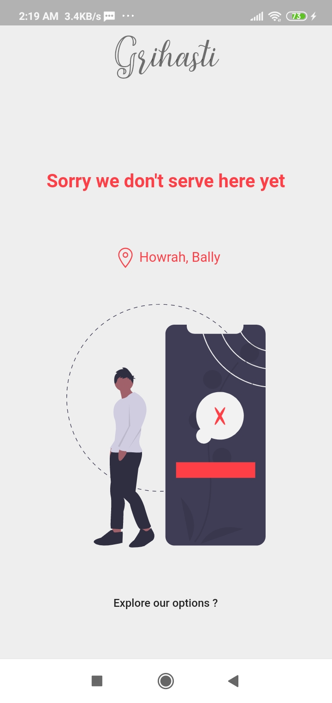

### Home

| 1 | 2 | 3 | 4 |
|---|---|---|---|
|  | 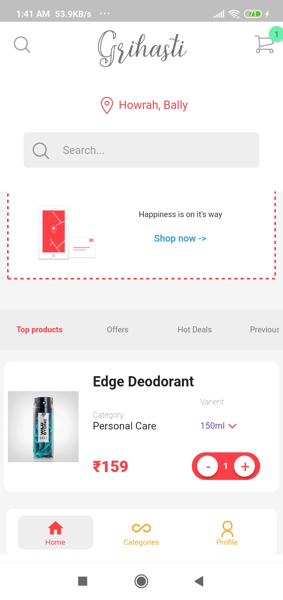 | 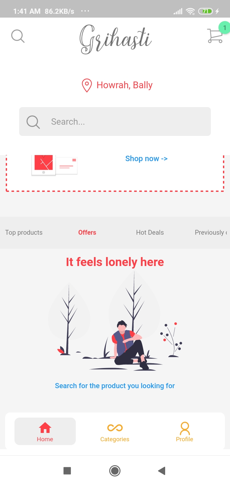 | 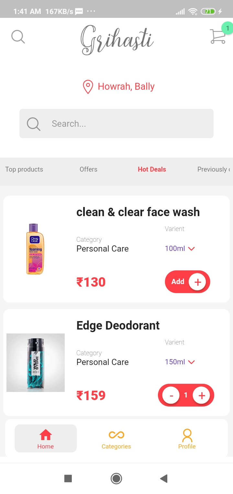 |

### Category Page

| 1 | 2 |
|---|---|
|  |  | 

### Product Page

| 1 | 2 |
|---|---|
|  |  | 

### Orders

| 1 | 2 | 3 |
|---|---|---|
| 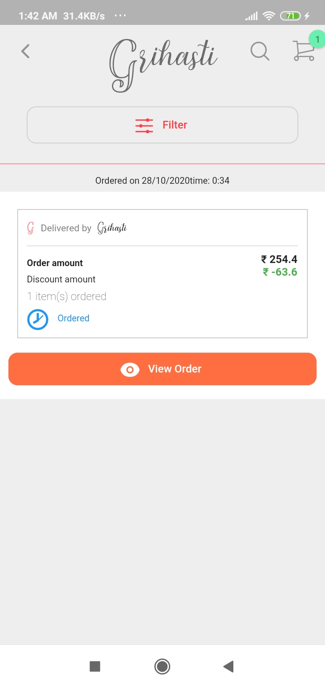 | 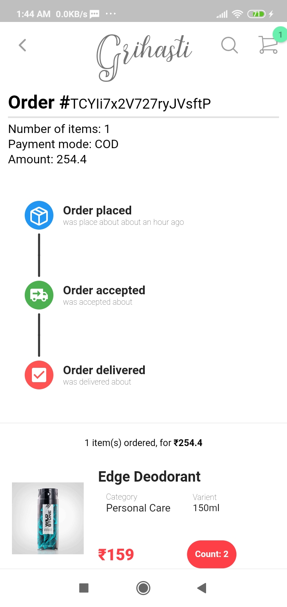 | 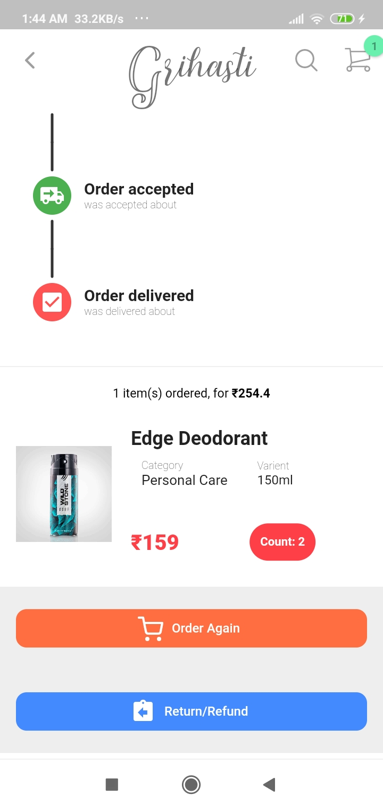 |

### Refund Page

| 1 | 2 |
|---|---|
| 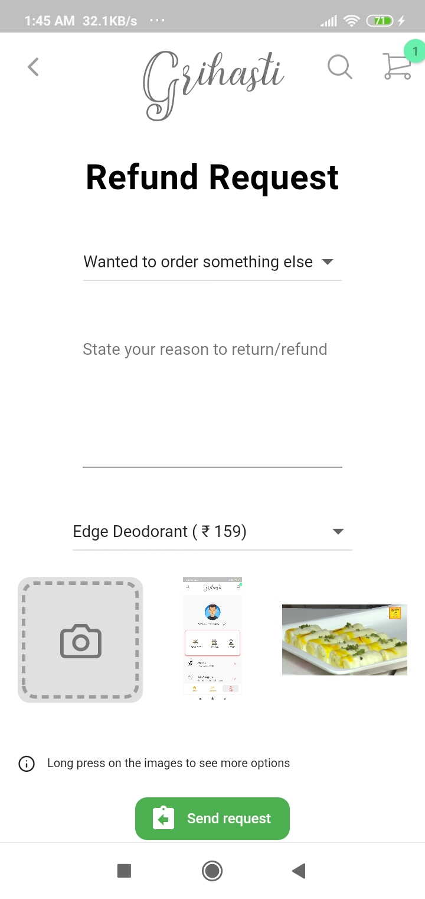 | 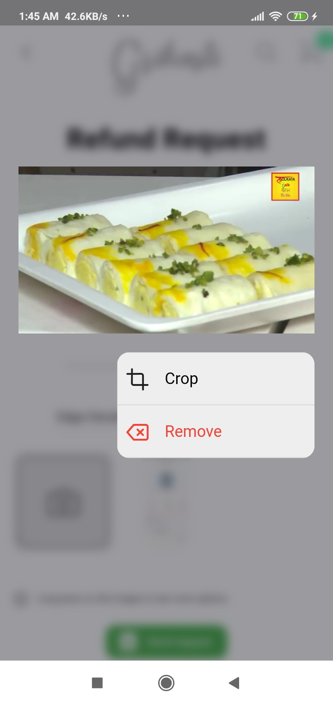 | 

### Search

| 1 | 2 |
|---|---|
|  |  | 

### Profile Page

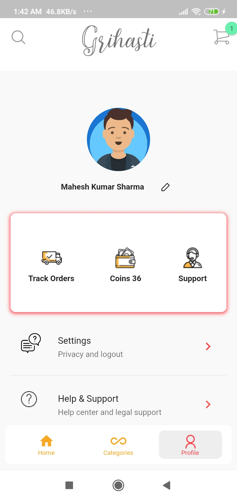